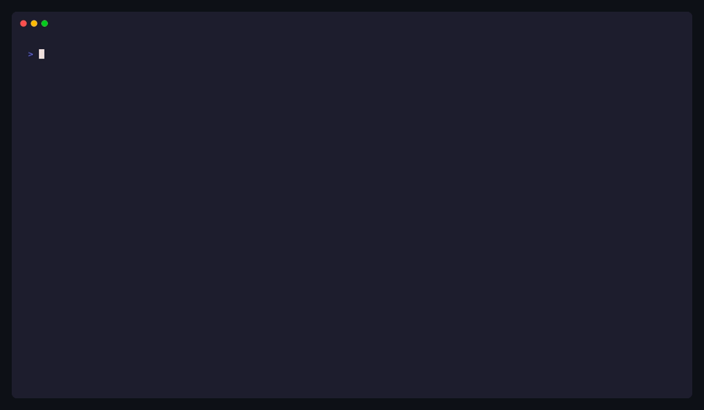

<h1><a href="#"></a>&nbsp;ForgeKit</h1>

**The engineering acceleration platform for AI, DevOps, and full-stack teams.**

[](LICENSE)
[](CONTRIBUTING.md)
[](https://developercertificate.org)
[](https://www.npmjs.com/package/forgekit-cli)
[](https://forgekit.build)
[](https://www.bestpractices.dev/projects/12234)

[](https://forgekit.build/coverage/)
[](https://nodejs.org/)
[](https://www.typescriptlang.org/)
[](https://jestjs.io/)
[](https://github.com/tj/commander.js)

[](https://www.npmjs.com/package/forgekit-cli)
[](https://github.com/SubhanshuMG/ForgeKit/stargazers)
[](https://github.com/SubhanshuMG/ForgeKit/network/members)
[](https://github.com/SubhanshuMG/ForgeKit/commits/main)

> **[Docs](https://forgekit.build)** | **[Templates](https://forgekit.build/templates/)** | **[CLI Reference](https://forgekit.build/cli-reference)** | **[Blog](https://blogs.subhanshumg.com/forgekit)** | **[Contributing](CONTRIBUTING.md)**

> **[Interactive Coverage Dashboard](https://forgekit.build/coverage/)**

ForgeKit eliminates the setup friction that costs engineering teams days of work before they write a single line of product code. One command scaffolds a fully wired, production-ready project, with the right stack, infrastructure, and tooling already connected.

<p align="center">
  
</p>

<p align="center">
  <a href="https://codespaces.new/SubhanshuMG/ForgeKit">
    
  </a>
  &nbsp;&nbsp;
  <a href="https://gitpod.io/#https://github.com/SubhanshuMG/ForgeKit">
    
  </a>
</p>

---

## Why ForgeKit?

Modern engineering teams waste too much time before they can ship:

- **Fragmented toolchains**, CI/CD, infrastructure, AI workflows, and frontend frameworks all need separate configuration
- **Slow Day-1 onboarding**, new projects and new teammates take hours to set up before they're productive
- **Reinventing the wheel**, the same scaffolding, Dockerfiles, and pipeline configs are written again and again
- **Burnout from maintenance**, keeping tooling up to date takes ~80% of platform team time
- **Poor documentation**, knowledge lives in people's heads, not the repo

ForgeKit solves all of this from a single CLI.

---

## Core Features

| Feature | Command | Description |
|---------|---------|-------------|
| **Project Scaffolding** | `forgekit new` | Beautiful interactive wizard to scaffold any stack in seconds |
| **AI Scaffolding** | `forgekit new --ai "describe your project"` | AI picks the best template for your description |
| **Template Marketplace** | `forgekit search` | Search official and community templates |
| **One-Command Deploy** | `forgekit deploy` | Auto-detect stack and deploy to Vercel/Railway/Fly |
| **Project Health Score** | `forgekit health` | Gamified 0-100 score across security, quality, testing, docs, DevOps |
| **Dependency Audit** | `forgekit audit` | Security vulnerabilities + outdated packages report |
| **Stack Doctor** | `forgekit doctor --project` | Diagnose system prerequisites + project health issues |
| **Environment Sync** | `forgekit env push/pull` | Encrypted .env file management across environments |
| **Docs Generation** | `forgekit docs generate` | Auto-generate README from your codebase |
| **Plugin System** | `forgekit plugin add/remove` | Extend ForgeKit with community plugins |
| **Template Publishing** | `forgekit publish` | Validate and prepare templates for the community registry |

---

## Quick Start

```bash
# Interactive wizard with beautiful terminal UI
npx forgekit-cli new

# AI-powered: describe your project, AI picks the template
npx forgekit-cli new --ai "REST API with PostgreSQL and JWT auth"

# Direct scaffolding with a specific template
npx forgekit-cli new my-app --template web-app

# Check your project health (gamified score!)
npx forgekit-cli health

# Audit dependencies for security issues
npx forgekit-cli audit

# Deploy with auto-detected provider
npx forgekit-cli deploy

# Generate docs from your codebase
npx forgekit-cli docs generate
```

Your project will be ready to run in under 60 seconds.

---

## See It In Action

```bash
npx forgekit-cli new my-app --template web-app
```

```
✔ Project my-app created successfully!
  16 files created in ./my-app

  → cd my-app && npm run dev
```

Your project will be fully wired and ready to run.

---

## From the Blog

**[Why I built ForgeKit](https://blogs.subhanshumg.com/forgekit)** — The story behind the project, the problem it solves, and where it's going next.

---

## Templates

| Template ID | Stack | Use Case |
|---|---|---|
| `web-app` | Node.js + React + TypeScript + Express | Full-stack web application |
| `next-app` | Next.js + TypeScript + Tailwind CSS | Modern React with SSR |
| `api-service` | Python + FastAPI + PostgreSQL + Docker | REST API backend |
| `go-api` | Go + Gin + PostgreSQL + Docker | High-performance API |
| `ml-pipeline` | Python + Jupyter + MLflow + scikit-learn | ML experiment workflow |
| `serverless` | TypeScript + AWS Lambda | Event-driven serverless |

More templates are coming. [Contribute a template →](https://forgekit.build/templates/)

---

## GitHub Action

Use ForgeKit directly inside your CI workflows:

```yaml
- uses: SubhanshuMG/ForgeKit/action@v1
  with:
    template: web-app
    name: my-app
```

See [action/README.md](action/README.md) for full usage, inputs, outputs, and matrix build examples.

---

## Architecture

ForgeKit is built as a modular 5-layer system:

```
Interface Layer  →  CLI / Web Dashboard / API Client
Application Layer  →  Workflow Engine / Task Orchestration
Service Layer  →  Scaffolding / AI / DevOps / Observability modules
Data Layer  →  Config storage / Execution logs / State
Infrastructure Layer  →  CI/CD / Deployment / Monitoring
```

See [architecture.md](.claude/architecture.md) for the full design.

---

## Roadmap

ForgeKit is being built in focused milestones:

- **Milestone 1** *(current)*, CLI scaffolding engine + 3 starter templates
- **Milestone 2**, Web dashboard + AI-assisted workflows
- **Milestone 3**, Ephemeral dev environments (preview URLs per PR)
- **Milestone 4**, AI Knowledge Hub (codebase Q&A + plugin marketplace)

See [ROADMAP.md](.claude/ROADMAP.md) for full details.

---

## Contributing

ForgeKit is built by engineers, for engineers. Contributions are welcome and encouraged.

- Read [CONTRIBUTING.md](CONTRIBUTING.md) for how to get started
- Find a [good first issue](https://github.com/SubhanshuMG/ForgeKit/issues?q=label%3A%22good+first+issue%22)
- Open a [Discussion](https://github.com/SubhanshuMG/ForgeKit/discussions) with questions or ideas
- Report security issues privately via [GitHub Security Advisories](SECURITY.md)

The fastest path in:
1. Pick a [`good first issue`](https://github.com/SubhanshuMG/ForgeKit/issues?q=label%3A%22good+first+issue%22)
2. Fork, branch, and build: `npm install && npm run build --workspace=packages/cli`
3. Commit with sign-off: `git commit -s -m "your message"` (DCO required)
4. Open a PR

All templates, docs improvements, and bug fixes are welcome. See [CONTRIBUTING.md](CONTRIBUTING.md) for full details.

---

## Community

- **[X/Twitter](https://x.com/forgekit_os)**, follow [@forgekit_os](https://x.com/forgekit_os) for updates
- **[LinkedIn](https://www.linkedin.com/company/forgekit-build)**, follow ForgeKit on LinkedIn
- **GitHub Discussions**, questions, ideas, show-and-tell
- **Discord**, real-time collaboration *(link coming at launch)*
- **Changelog**, monthly updates on what shipped

---

## Star History

<details>
<summary>View star growth chart</summary>
<br>

<a href="https://www.star-history.com/?repos=SubhanshuMG%2FForgeKit&type=date&legend=bottom-right">
 <picture>
   <source media="(prefers-color-scheme: dark)" srcset="https://api.star-history.com/image?repos=SubhanshuMG/ForgeKit&type=date&theme=dark&legend=bottom-right" />
   <source media="(prefers-color-scheme: light)" srcset="https://api.star-history.com/image?repos=SubhanshuMG/ForgeKit&type=date&legend=bottom-right" />
   
 </picture>
</a>

</details>

---

## License & Trademark

ForgeKit is open-source software licensed under the [Apache License 2.0](LICENSE).

"ForgeKit" and the ForgeKit logo are trademarks of the ForgeKit project maintainers.
The Apache 2.0 license grants you rights to use, modify, and distribute the *code*.
It does **not** grant rights to use the ForgeKit name or logo in ways that imply
official endorsement or affiliation. See [TRADEMARK.md](TRADEMARK.md) for permitted uses.

Copyright 2026 ForgeKit Contributors.

---

## Contributors

<!-- CONTRIBUTORS-START -->
<a href="https://github.com/SubhanshuMG/ForgeKit/graphs/contributors"></a>
<!-- CONTRIBUTORS-END -->
