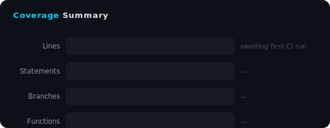

# ForgeKit Test Coverage

> Auto-generated on **2026-03-23 00:00:00 UTC** from commit [`initial`](https://github.com/SubhanshuMG/ForgeKit/commit/main) | [CI](https://github.com/SubhanshuMG/ForgeKit/actions)

---

## Summary

| Metric | Coverage | Covered / Total |
|--------|----------|-----------------|
| **Lines** | `—` | — / — |
| **Statements** | `—` | — / — |
| **Branches** | `—` | — / — |
| **Functions** | `—` | — / — |

> **Tests** : — passed / — total
>
> **Test Files** : —

---

## Coverage Chart

---

## Package Breakdown

| Package | Tests | Coverage Report |
|---------|-------|-----------------|
| **forgekit-cli** | — / — tests | [View Report](/coverage/lcov-report/) |

---

## Interactive Report

Browse line-by-line coverage with file drill-down and inline highlighting.

**[Open Interactive Coverage Report](/coverage/lcov-report/)** → full Istanbul HTML report hosted on forgekit.build

---

> This report will be updated automatically on every push to `main`.
> Push a commit or trigger the [Coverage Report workflow](https://github.com/SubhanshuMG/ForgeKit/actions/workflows/coverage.yml) to populate live data.

---

Generated by [ForgeKit CI](https://github.com/SubhanshuMG/ForgeKit/actions) · Coverage Report workflow
